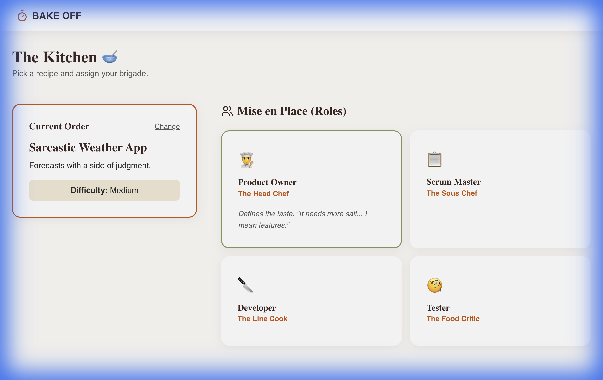
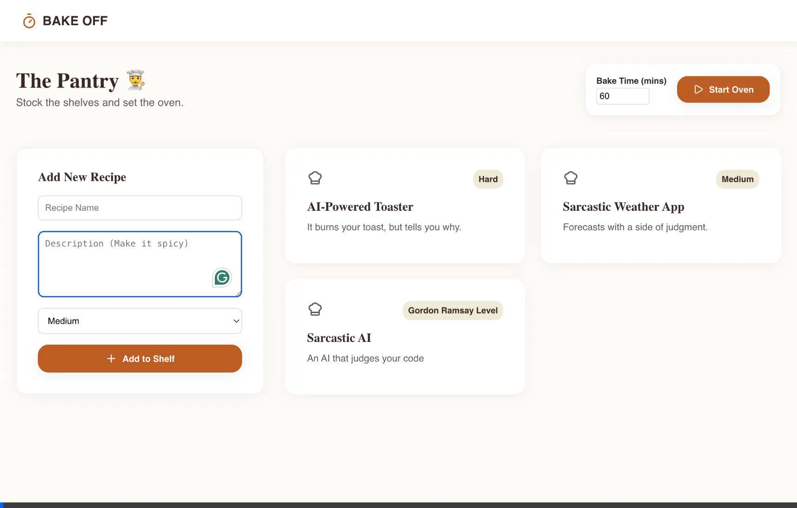

# Bake Off Hackathon Helper - Walkthrough

The "Bake Off" Hackathon Helper is ready to serve! This app manages your hackathon with a sarcastic "Great British Bake Off" theme, featuring role assignments, idea management, and a timer that yells at you.

## Features Implemented

### 1. The Pantry (Judges Dashboard)
- **Add Recipes**: Judges can add new hackathon ideas with a difficulty rating (e.g., "Gordon Ramsay Level").
- **The Oven**: A global timer that controls the game state.
- **Sarcastic Controls**: Start and stop the hackathon with visual feedback.

### 2. The Kitchen (Team Dashboard)
- **Pick a Recipe**: Teams can browse and select their challenge.
- **Mise en Place (Roles)**: Interactive role cards for Agile roles with a culinary twist:
    - **Product Owner** = Head Chef
    - **Scrum Master** = Sous Chef
    - **Developer** = Line Cook
    - **Tester** = Food Critic

### 3. The Oven (Timer & Notifications)
- **Visual Timer**: A progress bar that changes color as time runs out (Sage Green -> Golden Crust -> Burnt Orange).
- **Kitchen Nightmares**: Sarcastic toast notifications trigger at specific milestones (25%, 50%, 75%, 90%) to keep teams on their toes.

## Verification Results

### Automated Flow Test
We verified the following user flow:
1.  **Judge** enters the Pantry, adds a "Sarcastic AI" idea, and starts a 1-minute timer.
2.  **Team** enters the Kitchen, selects the idea, and assigns roles.
3.  **System** triggers notifications (e.g., "Aprons On!") as the timer counts down.

### Screenshots & Recordings

**The Kitchen (Team View)**

**The Pantry Flow (Recording)**

**The Kitchen Flow (Recording)**

## How to Run
1.  Ensure dependencies are installed: `npm install`
2.  Start the dev server: `npm run dev`
3.  Open `http://localhost:5173`